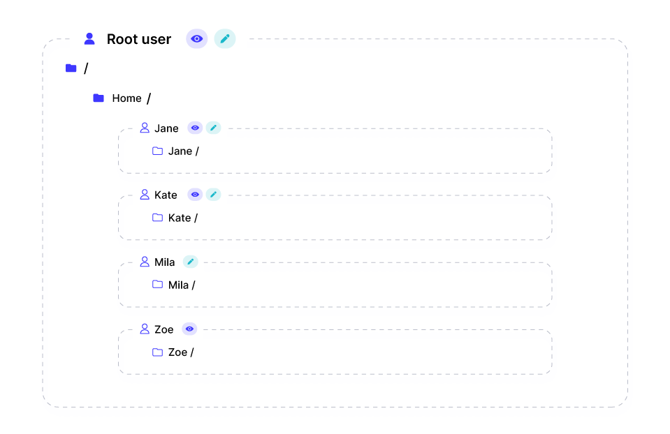
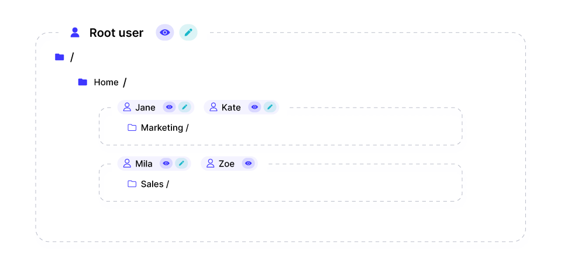
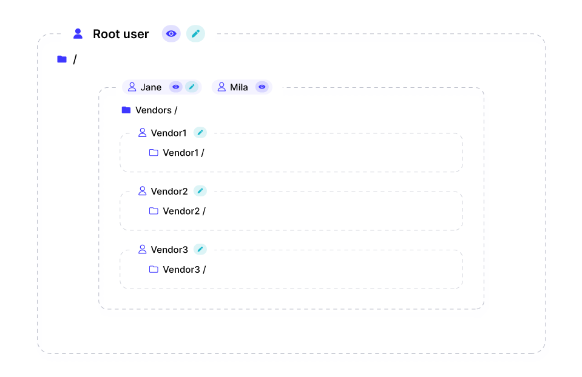

Users are created to grant people and machines access to the files stored within your organization's storage through SFTP, FTPS, or web access. 

Each organization starts with a single root user that has full access to the entirety of the storage. This means that it can access the root directory (`/`) along with any directory or file within it.

In order to provide restricted access to files and to be able to distinguish between users, you may [create more users](../getting-started/creating-and-modifying-users.md). 

Each user is equipped with a designated home directory and a permission set. Additionally, they are chrooted to their home directory, meaning that they only have access to their designated home directory as well as any files and folders underneath it. They do not have access to parent or sibling directories. In addition, when logging in with a specific user, its home directory would appear as root to it. For example, if `John`'s home directory is `/home/john/` and it contains a single file `example.txt`, once logged in, it would appear to John that there is a file `/example.txt` that is accessible to him.

You can create multiple users with the same home directory, which is beneficial if you want to permit them to access the same files (potentially, with different permissions), or nest home directories (that is, one home directory is a sub-directory of another home directory) for more advanced user access scenarios.

Case 1 - Access separation
---------------------

In the basic scenario, each user has access to its own folder and there is complete separation between the users, therefore no user can access another user's files, except the root user that already has access to the entire storage.

Case 2 - Shared folders
---------------------

In this scenario, Jane and Kate have read and write access to `/home/marketing/`, while Mila and Zoe have access to `/home/sales/`. Mila has read and write access to her home directory, while Zoe has read-only access. Jane and Kate can't access files in `/home/sales` , and Mila and Zoe cannot access any file or folder within `/home/marketing/`. Keep in mind that the root user can continue to access any folder or file. 

Case 3 - Nested folders
---------------------

In this scenario, Jane has read/write access to `/vendors/` and Mila has read-only access to `/vendors/`. Then, our vendor users, that for lack of creativity are named `vendor1`, `vendor2` and `vendor3`, have access to their corresponding home directories with write-only access. The vendors cannot access each other's folders, but Mila and Jane have access to any file uploaded by each one of the vendors.

